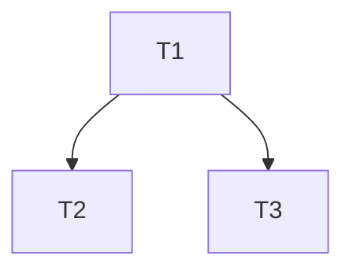

# /dag-execute — DAG-driven multi-agent pipeline

Orchestrate a GitLab issue end-to-end via 10 specialized agents (`product_bot`, `decomposer_bot`, `architect_bot`, `implementer_bot`, `ui_bot`, `adversary_bot`, `code_review_bot`, `final_review_bot`, `devops_bot`, `observer_bot`). Each agent returns a strict JSON envelope per `/workspace/.cursor/skills/json-handoff/SKILL.md`. You (the orchestrator) parse those envelopes, coordinate worktrees, manage branch dependencies, and gate the human at four HITL points.

**Arguments**: `$ARGUMENTS`
First token = GitLab issue IID. Remaining tokens = optional context appended to every subagent prompt.

You are NOT any single agent. You ONLY parse envelopes and dispatch `Task` calls.

---

## Mandatory reads (before Phase 0)

1. `/workspace/.cursor/skills/json-handoff/SKILL.md` — envelope contract.
2. `/workspace/CLAUDE.md` — repo conventions (RTK prefix, hooks, gates, branching).
3. The system reminder for project remote: `rtk git remote -v` to derive `<group/project>` for GitLab MCP calls.

---

## Phase 0 — Preparation

1. Parse `<iid>` from `$ARGUMENTS`.
2. Derive `<group/project>` from `rtk git remote -v`.
3. `mcp__GitLab__get_issue(project=<group/project>, issue_iid=<iid>)`.
4. Refuse to proceed if:
   - Issue not found.
   - Issue has label `needs-human-decision` → print issue summary and stop.
5. Print a status card:

```
Issue #<iid>: <title>
Labels: <labels>
Pipeline: /dag-execute
Phase: 0 → preparation OK
```

---

## Phase 1 — Product

Spawn `product_bot`:

```
Task(subagent_type=product_bot,
     prompt="Read /workspace/.cursor/agents/product_bot.md. Convert GitLab issue #<iid> in project <group/project> into structured stories. Return ONLY the JSON envelope.")
```

Parse the envelope. On `status="blocked"` → stop, surface `errors[]` to human.

On `hitl_required=true` → use `AskQuestion` with `hitl_reason` to clarify, then re-spawn with the answers in `clarifications[]`.

Render `payload.stories` and `payload.kpis` to a markdown comment and post via `mcp__GitLab__create_issue_note`. Title the comment `## Stories (product_bot)`.

---

## Phase 2 — Decompose

Spawn `decomposer_bot`:

```
Task(subagent_type=decomposer_bot,
     prompt="Read /workspace/.cursor/agents/decomposer_bot.md. Decompose **liberally** (layer-first: optional db, then backend/frontend; fold packages/types and small helpers into those tasks — no types-only micro-tasks). Given these stories: <inline product_bot.payload.stories>. Workspace map: apps/backend, apps/frontend, packages/types. Emit optional implements_after_gates per json-handoff (default parent gate completed); for stacked children use mr_opened unless risk requires completed. Return ONLY the JSON envelope.")
```

Parse. Validate the DAG yourself:

- Every `depends_on` ID exists in `tasks[]`.
- No cycles (DFS).
- ≤8 tasks (else surface the `hitl_required=true` from decomposer or escalate).

Post DAG as a markdown comment titled `## Task DAG (decomposer_bot)`. Include a Mermaid graph:



---

## Phase 3 — Architecture (HITL gate #1)

Spawn `architect_bot`:

```
Task(subagent_type=architect_bot,
     prompt="Read /workspace/.cursor/agents/architect_bot.md. Stories: <stories>. Tasks: <tasks>. Existing repo schema available via MariaDB MCP. Return ONLY the JSON envelope.")
```

Parse. Render `payload.api`, `payload.database`, `payload.risks` to a comment titled `## Architecture (architect_bot)`.

**HITL pause**:

```
AskQuestion(
  question="Approve architecture for issue #<iid>?",
  options=[
    { label: "approve", description: "Proceed to DAG execution" },
    { label: "revise", description: "Revise architecture (provide notes)" },
    { label: "abort", description: "Stop pipeline" }
  ]
)
```

- `approve` → label issue `architecture-approved`, continue to Phase 4.
- `revise` → re-spawn `architect_bot` with revision notes; loop.
- `abort` → print `aborted after architecture` and stop.

---

## Phase 4 — DAG Execution

### 4.0 Two-track scheduling (implement start vs finalize)

Orchestration is **two speeds**:

1. **Implement / MR track** — downstream tasks may exit `pending` and run **§4a–§4c** once **upstream dependencies** satisfy **`implements_after_gates`** (see `/workspace/.cursor/skills/json-handoff/SKILL.md` `decomposer_bot.payload`). A **child stacked on a parent branch** SHOULD default to **`mr_opened`** from the parent (not **`completed`**) unless architecture or risk dictates otherwise, so the child MR can iterate **while `devops_bot` watches the parent pipeline in the background**.
2. **Finalize track** — a task reaches **`completed`** only after **`devops`** returns **`status=ready`** (CI green for that MR/commit). **`final_review_bot` (Phase 5)** waits until **every** task is **`completed`**. **`devops_bot` must stay non-blocking** for unrelated ready work (**§4d**).

Treat **`implements_after_gates`** as **engineering readiness** (“can base / merge prerequisites?”). Merge order and human merge trains (**Phase 6**) stay unchanged.

Track per-task state: `pending | running | review | ci | completed | stuck`. Initialize all to `pending`.

Maintain retry counters per task: `code_review_rounds`, `gate_rounds` (each capped at 3). **Pre-MR alignment** (up to **3** completed `adversary_bot` **`rejected`** rounds, then HITL gate #2) runs **inside** one orchestrator `Task(implementer_bot)` — the implementer spawns `adversary_bot` via its own `Task` tool; see §4b.

Also maintain **`implementer_invocation_index`** per task (integer counter for **this** task’s **`4a`** worktree):

- Initialize to **`0`** once **`4a`** has created `<worktree_path>` (same task dispatch; do not reset between Code Review/CI loops).
- Immediately **before every orchestrator-issued** `Task(implementer_bot)` — first §4b dispatch after worktree bootstrap, stuck retries, **`4c`/`4d`/Final Review loops** — do **`implementer_invocation_index += 1`** and pass the new value into the prompt as **`implementer_invocation_index: <n>`**. **Do not** increment this counter for `adversary_bot` calls that the **implementer** spawns internally.
- **`implementer_bot`** runs **`rtk pnpm install --frozen-lockfile`** then **`rtk pnpm build`** only when **`n == 1`** unless dependency manifests changed or bootstrap failed (see `/workspace/.cursor/agents/implementer_bot.md` **Dependency install**). Independently, the implementer should **`rtk pnpm build`** again from the worktree root when **`packages/types`** (or other **`dist/`** consumers) change or when **typecheck / lint / knip** failures look like **stale build output** — not only on **`n == 1`**.

Normalize dependency gates (orchestrator): for each decomposition row **`t`** (tracked with `state` / `branch` in Phase 4) and parent id **`p`** in **`t.depends_on`**, **`gate(t,p)`** = **`t.implements_after_gates[p]`** when present on the decomposition object, else **`"completed"`**. Define **`parent_satisfies_gate(parent, gate)`** for **`parent`** the upstream tracker row:

- **`completed`** ⇒ `parent.state == "completed"`.
- **`mr_opened`** ⇒ `parent.state in {"review", "ci", "completed"}` (Draft MR opened after adversary §4b).
- **`code_review_ok`** ⇒ `parent.state in {"ci", "completed"}`.
- **`branch_published`** ⇒ `origin/<parent.branch>` is fetchable and known (use only when decomposition marks it explicitly).

Then **`impl_ready(t)`** = for every **`p`** in **`t.depends_on`**, **`parent_satisfies_gate(lookup(p), gate(t,p))`** holds.

```
loop:
  if all(t.state == "completed" for t in tasks):
    break

  ready = [ t for t in tasks if t.state == "pending" and impl_ready(t) ]

  if ready:
    # IMPORTANT: dispatch ALL ready tasks IN PARALLEL via multiple Task calls
    # in a single message. Do NOT serialize.
    for t in ready:
      t.state = "running"
    parallel_dispatch(ready)
    continue

  if any(t.state == "ci" for t in tasks):
    # Tasks waiting on GitLab CI (see §4d–§4e). Do not treat dependents as deadlock.
    reconcile_ci_outcomes()
    continue

  if any(t.state == "pending" for t in tasks) and not any(t.state in {"running", "review", "ci"} for t in tasks):
    if any(impl_ready(t) for t in tasks if t.state == "pending"):
      continue
    surface "DAG deadlock" to human and stop

  # Rare: in-flight `running` / `review` work across orchestrator turns; retry loop.
  continue
```

### Per-task dispatch sequence

Each task `t` runs through these substeps. The orchestrator runs them sequentially **for one task** but multiple tasks proceed concurrently.

#### 4a. Compute branch + base + worktree

**Goal:** dependents must **reuse prerequisite code**. Two patterns:

1. **Stacked MR (single dependency):** `<base>` **is that task’s branch name** (e.g. `feat-<iid>-T2-slug`). The Draft MR’s **merge target branch = `<base>`**, not `development`, until the parent has merged upstream and you rebase/reparent the child branch onto `development`.
2. **Integration branch (multiple dependencies):** `<base>` = `development`; after `rtk git worktree add … origin/development`, run **`rtk git merge origin/<each dep branch>`** for every dependency whose gate is satisfied by **`impl_ready`** (topo-safe order). Gates **`branch_published` / `mr_opened`** permit merges **before** the parent reaches **`completed`** intentionally; gate **`completed`** waits for CI-verified tips.

**Branch discovery:** Resolve parent branch names from **`get_merge_request` / bookkeeping** once the parent satisfies **`mr_opened`** or stricter — **do not wait for parent CI** when the decomposition used a relaxed gate.

```bash
type   = t.type if t.type in {"feat","fix"} else "feat"
slug   = kebab-case(t.title, max 4 words)
branch = "feat-<iid>-<t.id>-<slug>"

if t.depends_on == []
  base = "development"
else if length(t.depends_on) == 1
  # Stacked MR: branch from parent once impl_ready permits (often before parent CI completes)
  base = <parent_dep_branch_name_on_origin>
else
  # Parallel deps merged into feature branch — MR target stays development-oriented
  base = "development"

worktree_path = "/workspace/.worktrees/<iid>-<t.id>"

rtk git fetch origin
rtk git worktree add <worktree_path> -b <branch> origin/<base>
# If multiple deps: cd <worktree_path> && rtk git merge origin/<dep1> && rtk git merge origin/<dep2> … — do NOT omit or gate will fail:
# rtk git merge origin/feat-<iid>-T1-... && rtk git merge origin/feat-<iid>-T2-... ...

# One-off: copy `.env`/`.pem` from primary checkout (.gitignored) into this worktree. Derives source as
# parent of /.worktrees/<task>/ unless WORKTREE_SECRET_SOURCE is set — see scripts/bootstrap-worktree-env.mjs
cd <worktree_path>
node scripts/bootstrap-worktree-env.mjs

# Bootstrap node_modules from scratch so optional native deps (e.g. @oxc-parser/binding-*) resolve.
# Omitting this can leave incomplete installs where tools like knip fail inside the worktree only.
rm -rf node_modules
rtk pnpm install --frozen-lockfile
rtk pnpm build
```

Pass **`base`** to `implementer_bot` as `Base:` so **`create_merge_request.target_branch`** matches **stacked** vs **development** workflows (see `/workspace/.cursor/agents/implementer_bot.md`).

#### 4b. Implementer with internal pre-MR adversary (single orchestrator `Task`)

**First time** the task has no Draft MR yet (immediately after §4a): increment **`implementer_invocation_index`** and dispatch **one** `implementer_bot`. **Do not** spawn `adversary_bot` yourself — the implementer runs the **implement → push → `Task(adversary_bot)`** loop (max **3** completed `rejected` envelopes, then implementer returns **`stuck`** / HITL per gate #2) and then opens the Draft MR. Pass everything the implementer needs to forward to adversary: **`acceptance_criteria`**, **product stories + KPIs** as `stories_snippet`, **architecture excerpt** filtered to `<t.id>`, **`issue_title`**, plus worktree/branch/base/task id.

```
Task(subagent_type=implementer_bot,
     prompt="Read /workspace/.cursor/agents/implementer_bot.md. Implement task <t.id>. Worktree <worktree_path>. Branch <branch>. Base <base>. Architecture (filtered): <…>. Issue IID <iid>. Issue title: <title>. Stories snippet + KPIs: <product_bot excerpt>. acceptance_criteria: <t.acceptance_criteria>. **Omit existing_mr_iid** (no Draft MR yet). code_review_issues: []. implementer_invocation_index: <n>. Return ONLY the JSON envelope.")
```

Parse implementer:

- `status="ok"`, **`mr_opened=true`**, `mr_iid` set → `state=review`, store `mr_iid`. Pre-MR adversary alignment is already reflected in **`payload.gate_output.adversary_alignment`** / optional **`adversary_rounds_used`**.
- **`hitl_required=true`** with adversary non-convergence, or **`status="stuck"`** with **`errors[].code == "adversary_non_convergence"`** (three `rejected` adversary rounds, no MR) → **HITL gate #2** — do **not** treat as a generic `gate_rounds` retry.
- **`status="stuck"`** for **quality gates / tooling** (per `errors[]`) → re-spawn implementer with the same prompt shape; increment `gate_rounds`; at 3 → HITL gate #2.
- `status="blocked"` (other reasons) → stop pipeline; `hitl_required` → AskQuestion.

**After Draft MR exists** (§4c rejection, §4d CI failure, Final Review fixes): increment **`implementer_invocation_index`** and dispatch implementer with **`existing_mr_iid: <mr_iid>`**, **`code_review_issues`** and/or CI notes — **no** internal pre-MR adversary loop; push updates only.

#### 4c. Code Review

Re-opens of `implementer_bot` **after** Draft MR creation pass **`existing_mr_iid: !<mr_iid>`** in the prompt — MR already exists; the implementer pushes updates to the existing branch only.

```
Task(subagent_type=code_review_bot,
     prompt="Read /workspace/.cursor/agents/code_review_bot.md. Task: <t.id>. MR: !<mr_iid>. Branch: <branch>. Base: <base>. Worktree: <worktree_path>. Acceptance criteria: <t.acceptance_criteria>. Return ONLY the JSON envelope.")
```

- `verdict="approved"` → `state=ci`.
- `verdict="rejected"` and `code_review_rounds < 3` → loop back to 4b with `issues[]` injected; increment counter.
- `verdict="rejected"` and `code_review_rounds == 3` → HITL gate #2.

#### 4d. DevOps (background — do not block the orchestrator)

When looping **after CI failure**, **`implementer_bot`** already has an open Draft MR — include **`existing_mr_iid`** in the prompt.

After **code review** approves (`state=ci`), CI can take many minutes. Spawn **`devops_bot` in the background** so the orchestrator can keep driving **other** Phase 4 tasks (and the main session is not stuck idle on long polls).

```
Task(subagent_type=devops_bot,
     run_in_background=true,
     prompt="Read /workspace/.cursor/agents/devops_bot.md. Project (GitLab MCP project_id): <group/project>. MR: !<mr_iid>. Branch: <branch>. Return ONLY the JSON envelope.")
```

- Track each task in `ci` as **awaiting** a `devops_bot` envelope (e.g. background agent id / completion notification). Do **not** synchronously await this `Task` before dispatching independent ready tasks.
- When several MRs need CI at once, issue **one background `devops_bot` per MR** in the **same** message (parallel background tasks).

Apply the envelope when it arrives (same rules as before):

- `status="ready"` → `state=completed`.
- `status="failed"` → loop back to 4b with `checks[]` failures; increment `gate_rounds`.
- `status="running"` (timeout) → spawn **one** follow-up `devops_bot` (background or synchronous is OK); if still `running`, escalate / HITL.

**Synchronous `devops_bot` is allowed** only when you deliberately need a blocking check (e.g. single-task issue, human asked to wait, or debugging). Default path: **`run_in_background=true`**.

#### 4e. CI reconciliation and outer loop

Tasks stay in **`ci`** until their `devops_bot` outcome is applied. The Phase 4 loop’s **`reconcile_ci_outcomes()`** step MUST:

1. Wait on or collect each outstanding background `devops_bot` completion (platform notification, documented background handoff, or a **short** GitLab MCP poll for MR pipeline status if the envelope was lost).
2. Parse the JSON envelope and apply §4d transitions (`completed` vs re-enter 4b).

When applying **`completed`**, if the **`devops_bot` envelope referenced an older HEAD** than **`get_merge_request` diff head** for that MR, **re-run `devops_bot` (background)** on the latest SHA before marking **`completed`**.

Do **not** enter Phase 5 until every task is **`completed`** (code review done **and** CI green **for the HEAD that will merge**).

#### 4f. Mark task completed and continue the outer loop.

---

## Phase 5 — Final Review (HITL gate #3)

Once all tasks have `state="completed"` (Draft MRs are open, **code_review** + CI green per task — **pre-MR adversary alignment ran inside `implementer_bot` before the Draft MR opened**):

```
Task(subagent_type=final_review_bot,
     prompt="Read /workspace/.cursor/agents/final_review_bot.md. Issue: #<iid>. Stories: <stories>. Tasks: <tasks>. MR IIDs: <mr_iids>. Return ONLY the JSON envelope.")
```

- `verdict="approved"` → continue to Phase 6.
- `verdict="rejected"` with all `issues[].task_ids_affected` populated:
  - For each affected task `t`: re-enter Phase 4b for that task with the issues injected; increment `code_review_rounds`.
  - Re-run Phase 5 after fixes propagate.
  - Cap: 3 full Final Review rounds. After that → HITL gate #3 escalation.
- `verdict="rejected"` with no `task_ids_affected` (cross-cutting) → escalate to human immediately.

---

## Phase 6 — Merge (HITL gate #4)

Compute topological order of completed tasks. For each task `t` in topo order:

1. Mark MR ready (`mcp__GitLab__update_merge_request(draft=false)`).
2. AskQuestion:

```
AskQuestion(
  question="Merge MR !<mr_iid> for task <t.id> (<t.title>)?",
  options=[
    { label: "merge", description: "I will merge in GitLab UI; confirm when done" },
    { label: "skip", description: "Skip; merge later manually" },
    { label: "abort", description: "Stop the merge train" }
  ]
)
```

3. The orchestrator NEVER calls `mcp__GitLab__merge_merge_request`. The human merges via GitLab UI; replies `merge`/`skip`/`abort`.
4. After human confirms `merge`:
   - Verify with `mcp__GitLab__get_merge_request` that `state=merged`.
   - For every dependent task whose `base_branch` was `t.branch`:

     ```bash
     cd /workspace/.worktrees/<iid>-<dep_id>
     rtk git fetch origin
     rtk git rebase --onto development <t.branch> <dep.branch>
     rtk git push --force-with-lease origin <dep.branch>
     ```

     `--force-with-lease` is in the `ask` permission list — confirm with the human before each push.

5. Clean up:

   ```bash
   rtk git worktree remove --force /workspace/.worktrees/<iid>-<t.id>
   rtk git branch -d <t.branch>
   ```

   `rtk git branch -d` is safe (refuses if not merged); `rtk git worktree remove --force` is in `ask` — confirm.

When all MRs in topo order are merged or skipped, print the summary card:

```
Pipeline done.
Issue: #<iid>
Tasks: <count> total, <merged> merged, <skipped> skipped, <stuck> stuck
Worktrees cleaned: yes
Run /observe <mr_iid> to analyze post-merge health (optional).
```

---

## Phase 7 — Observe (manual, async)

NOT auto-invoked. The user runs `/observe <mr_iid>` later if they want post-merge analysis.

---

## HITL gate summary

| #   | Gate                                                                            | Trigger                                      | Action                                             |
| --- | ------------------------------------------------------------------------------- | -------------------------------------------- | -------------------------------------------------- |
| 1   | Architecture sign-off                                                           | After `architect_bot` returns                | `AskQuestion`: approve / revise / abort            |
| 2   | Implementer stuck, adversary non-convergence (3 adversary rounds), CR, or gates | 3 rounds same scope (or implementer `stuck`) | `AskQuestion`: retry / abort-task / abort-pipeline |
| 3   | Final Review rejected (cross-cutting or 3 rounds)                               | After Phase 5                                | Escalate to human with full issue list             |
| 4   | Merge approval                                                                  | Per MR in Phase 6                            | `AskQuestion`: merge / skip / abort                |

---

## Failure handling

If any agent returns `status="blocked"`:

- Print the agent name, reason, and `errors[]`.
- Stop the pipeline.
- DO NOT clean up worktrees automatically — the human may want to inspect them.

If your own JSON parse fails (agent output not envelope-shaped):

- Treat it as `status="stuck"` with `errors=[{ code: "envelope_parse_error", message: <raw_output_excerpt> }]`.
- The `validate-envelope.sh` PostToolUse hook will have already warned.
- Retry the agent ONCE with explicit reminder: "Return ONLY the JSON envelope. No prose."

---

## Forbidden (orchestrator-level)

- Editing source files yourself. Implementers do that.
- Approving or merging MRs (`mcp__GitLab__approve_merge_request`, `mcp__GitLab__merge_merge_request`). Always human.
- Skipping HITL gates because "it looks fine."
- Running tasks serially that have no dependency on each other (parallel dispatch is REQUIRED — single-message-multi-Task-call).
- Awaiting **`devops_bot` synchronously** after code review when other independent Phase 4 work could proceed (default: **`run_in_background=true`**; see §4d–§4e).
- Ignoring **`implements_after_gates`** — implement start readiness is **`impl_ready`** per `/workspace/.cursor/skills/json-handoff/SKILL.md`; **`completed`** stays CI-gated.
- Mutating CLAUDE.md, AGENTS.md, .claude/, .cursor/ — these are harness files; agents must not edit their own definitions.

---

## Status card (refresh between phases)

After every phase transition, print:

```
Issue: #<iid>
Phase: <0|1|2|3|4|5|6>
Tasks: T1=<state>, T2=<state>, ...
HITL pending: yes|no (<gate_name>)
```

This gives the human a continuous view of what's happening.
