# /pm-execute — Run the specialist pipeline

Run the **execution** half of the pipeline (including `worktree_bot` after Ops) on an existing GitLab issue (normally produced by the `pm-plan` skill).

Full playbook lives in [`.claude/commands/pm-execute.md`](../../../.claude/commands/pm-execute.md). Under Cursor, this skill is the user-invokable entry point; the same instructions apply.

## How to invoke

Open a Cursor chat and type:

> Run the pm-execute skill for issue `#<iid>` (optional extra context)

## Pipeline stages

```mermaid
flowchart LR
    Start[/Issue IID/] --> Explore[explorer_bot\nTechnical Brief]
    Explore --> HITL1{Arch/data tradeoff?}
    HITL1 -->|yes| Human1((Human))
    HITL1 -->|no| Ops1[ops_bot\ninstall --force + knip]
    Ops1 --> WTB[worktree_bot\npnpm worktree:ensure]
    WTB --> Ctx[orchestrator\nfill CONTEXT.local.md]
    Ctx --> Dev[developer_bot\nimplement + gates]
    Dev --> Adv[adversary_bot\nhostile review]
    Adv -->|fail| Dev
    Adv -->|pass| Ops2[ops_bot\ncommit + push + ready MR]
    Ops2 --> Review[review_bot\ncriteria trace + notes]
    Review --> HITL2{request-changes?}
    HITL2 -->|yes| Dev2[developer_bot\naddress threads]
    Dev2 --> Adv2[adversary_bot]
    Adv2 -->|fail| Dev2
    Adv2 -->|pass| Ops3[ops_bot\npush to same MR]
    Ops3 --> Review
    HITL2 -->|no| Merge[/Human merges/]
```

## What each stage does

- **Explorer** — skipped if the issue already has a `## Technical Brief` section; otherwise produces it and pauses for your approval.
- **Ops (branch)** — in the **primary clone**, fetches, creates branch `<type>-<iid>-<slug>` from `origin/development` (no `git worktree add`), runs `pnpm install --force` and `pnpm knip` (must pass) at the **repository root**, and creates a **`CONTEXT.local.md` stub** with a **canonical** path (`cd "$(git rev-parse --show-toplevel)" && pwd -P`); returned `worktree_path` must match that string (see `.cursor/skills/ops-git-worktrees/SKILL.md`).
- **Worktree (`worktree_bot`)** — runs `pnpm run worktree:ensure` in that worktree (verifies `node_modules` is not a foreign symlink and that a workspace package resolves under the worktree; see `scripts/ensure-worktree-pnpm.mjs`). Stops the pipeline with a human handoff if this fails.
- **Orchestrator (context)** — ensures `CONTEXT.local.md` has acceptance criteria and Technical Brief (paste from Phase 0 into the first `developer_bot` prompt if still `[pending]`).
- **Developer** — reads `CONTEXT.local.md` first, implements, delegates to domain bots with the **Task prompt checklist** in `developer-impl`, runs `pnpm knip && typecheck && format:check && lint && reseed && test` in that clone.
- **Adversary** — static hostile audit **anchored on `git diff` `merge_base..HEAD` in that repository** (read-only `git`); scoped `workspace-gate` for knip/lint/tc; per-finding `scope` and `diff_anchoring` in JSON per `adversarial-review` skill. Returns JSON verdict.
- **Ops (commit/MR)** — chunks the diff into logical Conventional Commits, pushes, opens a **non-draft** merge request (`draft: false`) so the MR shows as Ready. On **review-fix** passes, only commits and push to the same branch; does not create a second MR. If a commit or hook fails, Ops returns to Developer with full output; Developer must re-run the **full** pnpm quality gates in the same clone (no `HUSKY=0` / hook bypass), then Adversary if needed, then Ops retries.
- **Review** — treats issue + Technical Brief + acceptance criteria as the **scope contract** (see `code-review-checklist`); delegates a semantic pass to `gitlab-assistant` (Duo), writes draft notes on the MR, publishes them in one batch, posts a criteria-trace summary. If verdict is `request-changes`, the **orchestrator** summarizes threads as a **table** (file → ask), re-runs **Developer** (updates `CONTEXT.local.md` review queue) → **Adversary** → **Ops** push, then **Review** again, until `comment` / `approve-pending-human` (cap e.g. 3 review passes, then HITL).

## Human-in-the-loop gates

You will be paged via `AskQuestion` when any of these happen:

1. Issue has label `needs-human-decision`.
2. Explorer finds architecture/data-model tradeoffs.
3. Developer ↔ Adversary have not converged after 3 rounds.
4. Ops cannot push (protected branch, force-push required, etc.).
5. Review-fix loop hits the cap without a clean verdict, or `needs-human-decision` cannot be cleared by agents.
6. Merge — **always** your action. The pipeline never auto-merges.

## What the agents will refuse

- **Ops** will refuse to edit any file.
- **Developer** will refuse to run any `git` command or call any GitLab MCP tool.
- **Adversary** will refuse to run `pnpm test` or **mutate** `git` (read-only `git` for diff anchoring is allowed).
- **Review** will refuse to call `approve_merge_request` / `accept_merge_request`.

## Handoff after merge

After you merge the MR in GitLab, run (manually or via a follow-up chat):

> Ask ops_bot to delete branch `<type>-<iid>-<slug>` locally and on the remote (and remove a **legacy** `.worktrees/…` path only if you still use that older layout).
