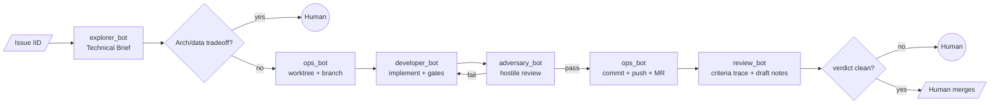

# /pm-execute — Run the specialist pipeline

Run the **execution** half of the 6-specialist pipeline on an existing GitLab issue (normally produced by the `pm-plan` skill).

Full playbook lives in [`.claude/commands/pm-execute.md`](../../../.claude/commands/pm-execute.md). Under Cursor, this skill is the user-invokable entry point; the same instructions apply.

## How to invoke

Open a Cursor chat and type:

> Run the pm-execute skill for issue `#<iid>` (optional extra context)

## Pipeline stages

## What each stage does

- **Explorer** — skipped if the issue already has a `## Technical Brief` section; otherwise produces it and pauses for your approval.
- **Ops (branch)** — creates `.worktrees/<iid>-<slug>/` off `origin/development` with branch `<type>/<iid>-<slug>`.
- **Developer** — reads the brief, implements, delegates to domain bots (`backend_bot`, `frontend_bot`, `tester_bot`, `types_bot`, etc.), runs `pnpm knip && typecheck && format:check && lint && test` in the worktree.
- **Adversary** — static hostile audit **anchored on `git diff` `merge_base..HEAD` in the worktree** (read-only `git`); scoped `workspace-gate` for knip/lint/tc; per-finding `scope` and `diff_anchoring` in JSON per `adversarial-review` skill. Returns JSON verdict.
- **Ops (commit/MR)** — chunks the diff into logical Conventional Commits, pushes, opens a **draft** MR.
- **Review** — delegates a semantic pass to `gitlab-assistant` (Duo), writes draft notes on the MR, publishes them in one batch, posts a criteria-trace summary, and marks the MR **ready** (`draft: false`) when the verdict is not `request-changes`.

## Human-in-the-loop gates

You will be paged via `AskQuestion` when any of these happen:

1. Issue has label `needs-human-decision`.
2. Explorer finds architecture/data-model tradeoffs.
3. Developer ↔ Adversary have not converged after 3 rounds.
4. Ops cannot push (protected branch, force-push required, etc.).
5. Review verdict is `request-changes` or flags `needs-human-decision`.
6. Merge — **always** your action. The pipeline never auto-merges.

## What the agents will refuse

- **Ops** will refuse to edit any file.
- **Developer** will refuse to run any `git` command or call any GitLab MCP tool.
- **Adversary** will refuse to run `pnpm test` or **mutate** `git` (read-only `git` for diff anchoring is allowed).
- **Review** will refuse to call `approve_merge_request` / `accept_merge_request`.

## Handoff after merge

After you merge the MR in GitLab, run (manually or via a follow-up chat):

> Ask ops_bot to remove worktree `.worktrees/<iid>-<slug>` and prune branch `<type>/<iid>-<slug>`.
