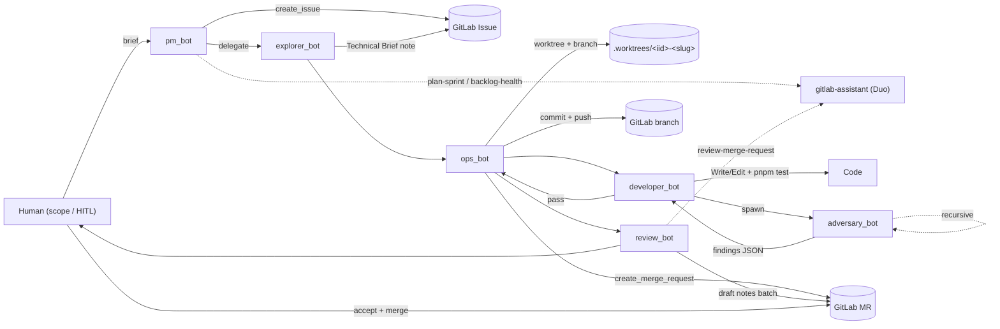
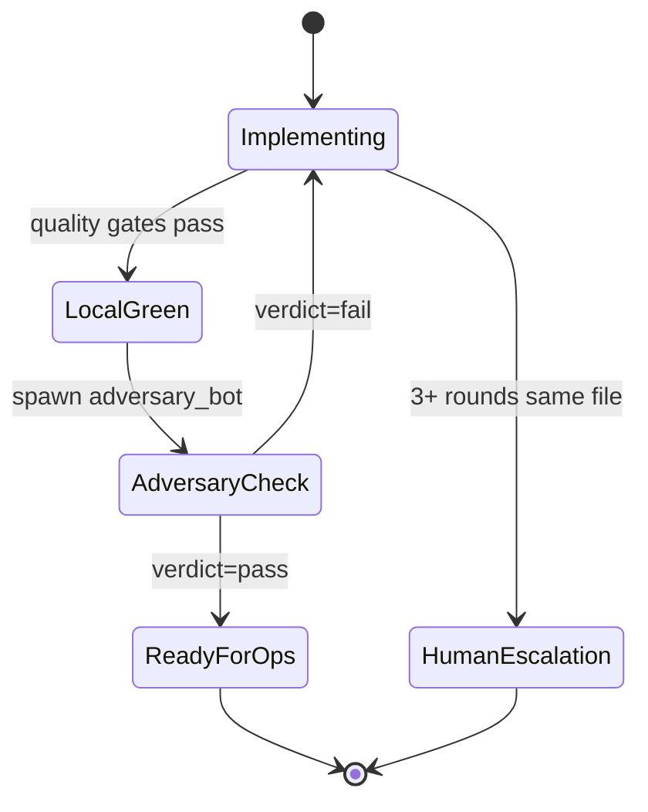

# AGENTS.md — Agentic Workflow Harness

This file is the contract shared by every agent that operates on this repository. It defines the 6 workflow-role specialists, the sandbox they run in, the handoff artifacts between them, and the human-in-the-loop (HITL) gates.

Every specialist **must** read this file and the skill file referenced in its agent definition before taking its first action.

> Enforcement: sandbox rules are applied by Claude Code via per-agent `tools:` frontmatter in [`.claude/agents/`](.claude/agents) plus the `permissions.allow`/`deny` lists in [`.claude/settings.json`](.claude/settings.json). Under Cursor, the same policy is documented in [`.cursor/agents/`](.cursor/agents) but not runtime-enforced; Cursor agents must self-police.

## Mission

Humans discuss a feature or bug with `pm_bot`. The PM scopes it into a GitLab issue with explicit acceptance criteria. `explorer_bot` decomposes it into a technical brief. `ops_bot` creates a worktree + branch. `developer_bot` implements, running the Adversary feedback loop until clean. `ops_bot` commits in chunks, pushes, and opens the MR. `review_bot` audits against acceptance criteria. **Humans merge.**

## Pipeline



## The 6 specialists

| Role                                               | File             | Writes code                   | Touches git | Spawns                                | Notes                                 |
| -------------------------------------------------- | ---------------- | ----------------------------- | ----------- | ------------------------------------- | ------------------------------------- |
| [`pm_bot`](.claude/agents/pm_bot.md)               | Orchestrator     | No                            | No          | Explorer, Ops, Developer, Review, Duo | Human liaison                         |
| [`explorer_bot`](.claude/agents/explorer_bot.md)   | Researcher       | No                            | No          | —                                     | DB MCP readonly, WebSearch/WebFetch   |
| [`ops_bot`](.claude/agents/ops_bot.md)             | Git + GitLab     | No                            | Yes         | —                                     | Only git-capable agent                |
| [`developer_bot`](.claude/agents/developer_bot.md) | Implementer      | **Yes**                       | No          | Adversary + existing domain bots      | Runs quality gates                    |
| [`adversary_bot`](.claude/agents/adversary_bot.md) | Hostile reviewer | No (lint/knip/typecheck only) | Read-only   | Adversary (depth ≤ 3)                 | Diff-anchored review; gate before Ops |
| [`review_bot`](.claude/agents/review_bot.md)       | PR auditor       | No                            | No          | Duo `review-merge-request`            | Never approves/merges                 |

Full policy per role lives in [`.cursor/agents/<role>.md`](.cursor/agents) (policy record) and [`.claude/agents/<role>.md`](.claude/agents) (runtime enforcement).

### Coexistence with existing domain bots

The following pre-existing specialists in [`.cursor/agents/`](.cursor/agents) remain available as **sub-specialists** that `developer_bot` can call via `Task` for domain depth — they are **not** part of the primary workflow:

- `backend_bot`, `frontend_bot`, `tester_bot`, `types_bot`, `refactor_bot`, `docs_bot`, `verifier_bot`

Only `developer_bot` may spawn them.

## Handoff contract

Every stage transition produces a typed artifact. Agents do not begin their stage until the previous artifact exists.

| From → To                    | Artifact                                                                           | Location                        |
| ---------------------------- | ---------------------------------------------------------------------------------- | ------------------------------- |
| Human → PM                   | Natural-language brief                                                             | Chat                            |
| PM → Explorer                | GitLab issue IID + acceptance criteria                                             | GitLab issue body               |
| Explorer → Ops               | Issue updated with `## Technical Brief` section (+ optional sub-issue IIDs linked) | GitLab issue note / description |
| Ops → Developer              | `{ worktree_path, branch_name, issue_iid }`                                        | Tool return value               |
| Developer → Adversary        | "ready for review" note on issue: list of changed files + local gate output        | GitLab issue note + prompt      |
| Adversary → Developer (loop) | Findings JSON (`verdict`, `findings[]`)                                            | Tool return value               |
| Adversary → Developer (pass) | `{ verdict: "pass", findings: [] }`                                                | Tool return value               |
| Developer → Ops              | Note on issue: file list + ready-to-commit signal                                  | GitLab issue note               |
| Ops → Review                 | `{ mr_iid, commit_sha_range }`                                                     | Tool return value               |
| Review → Human               | Summary MR note with verdict + `needs-human-decision` label if non-clean           | GitLab MR note                  |
| Human → GitLab               | Merge                                                                              | GitLab UI / API                 |

## Adversarial feedback loop



- Rounds 1–2: Developer addresses findings and re-invokes Adversary.
- Round 3 on the same file range: Developer stops and returns a disagreement summary. PM pages the human.

## HITL gates (human is required)

1. **Scope / acceptance criteria** — PM asks `AskQuestion` before creating the issue when intent is ambiguous, cross-cutting, or has meaningful tradeoffs.
2. **Architecture & data modeling** — any schema/migration/trigger change is HITL; PM blocks Explorer until the human confirms approach.
3. **Adversary ↔ Developer non-convergence** — 3+ rounds on the same file range pages the human.
4. **Review verdict non-clean** — `needs-human-decision` label is added; no further automation.
5. **Merge** — `mcp__GitLab__approve_merge_request` / `accept_merge_request` are denied to every agent. Merge is **always** a human action.

## Sandboxing — deny-all + explicit allowlist

1. **Per-agent `tools:` frontmatter** in [`.claude/agents/<role>.md`](.claude/agents) is the primary allowlist. Tools not listed are unavailable to that agent.
2. **Repo-wide `permissions` in [`.claude/settings.json`](.claude/settings.json)** add a global `deny` for dangerous patterns (`git push --force`, `--no-verify`, `sudo`, `rm -rf /`, `curl | sh`, etc.) and an `allow` list for the exact shell patterns the pipeline needs. Destructive-but-sometimes-needed commands (`git reset --hard`, `git worktree remove`, `git branch -D`) require confirmation via the `ask` list.
3. **MCP surface** is constrained by `enabledMcpjsonServers` in settings; per-agent narrowing happens in `tools:` using the `mcp__<server>__<tool>` naming.
4. **Hooks** in [`.claude/hooks/`](.claude/hooks) provide defense-in-depth at the `PreToolUse` / `PostToolUse` / `Stop` phases (e.g. `block-e2e-wrong-dir`, `warn-as-cast`, `remind-quality-gates`).

Under Cursor the enforcement is policy-only. The [`.cursor/agents/`](.cursor/agents) files encode the same allow/deny as the Claude versions; agents self-report violations.

## MCP matrix

- **GitLab MCP (stdio, `project-0-workspace-GitLab`)** — `pm_bot` (issue tools), `ops_bot` (branch + MR transactional tools), `review_bot` (MR read + draft-note tools), `explorer_bot` (issue notes + links only). `developer_bot` and `adversary_bot` have **no** GitLab access.
- **Cursor Duo `gitlab-assistant`** — invoked via `Task(subagent_type=gitlab-assistant, ...)` for `plan-sprint`, `backlog-health` (PM), and `review-merge-request` (Review).
- **mariadb MCP (readonly)** — `explorer_bot`, `developer_bot`. Schema exploration only; application queries still use Knex (see [CLAUDE.md](CLAUDE.md)).
- **Playwright MCP** — `developer_bot` only (debug/assertion on dashboard flows). See [.cursor/skills/playwright-mcp-admin-auth/SKILL.md](.cursor/skills/playwright-mcp-admin-auth/SKILL.md).
- **shadcn/ui MCP** — `developer_bot` only (component discovery).
- **faceit MCP** — not wired to any of the 6 specialists by default; add explicitly if a feature requires it.

## Quality gates (Developer is responsible)

Copied from [CLAUDE.md](CLAUDE.md) — all must pass locally before invoking `adversary_bot`:

```bash
cd $(git rev-parse --show-toplevel)
pnpm knip
pnpm typecheck
pnpm format:check
pnpm lint
pnpm test          # affected workspaces
```

E2E (`pnpm test:e2e`) runs only from the workspace root per [.cursor/skills/e2e-playwright/SKILL.md](.cursor/skills/e2e-playwright/SKILL.md).

## Worktrees

All work for an issue happens in a dedicated worktree created by `ops_bot`:

```
<repo>/.worktrees/<iid>-<slug>/
```

`.worktrees/` is gitignored. Branch naming and commit chunking rules are in [.cursor/skills/ops-git-worktrees/SKILL.md](.cursor/skills/ops-git-worktrees/SKILL.md).

## Skills index (per-domain)

Each specialist auto-reads its primary skill plus cross-cutting ones. Full list:

- [`pm-workflow`](.cursor/skills/pm-workflow/SKILL.md)
- [`explorer-research`](.cursor/skills/explorer-research/SKILL.md)
- [`ops-git-worktrees`](.cursor/skills/ops-git-worktrees/SKILL.md)
- [`developer-impl`](.cursor/skills/developer-impl/SKILL.md)
- [`adversarial-review`](.cursor/skills/adversarial-review/SKILL.md)
- [`code-review-checklist`](.cursor/skills/code-review-checklist/SKILL.md)

Cross-cutting skills used by multiple specialists live in the same [`.cursor/skills/`](.cursor/skills) tree: `tdd-workflow`, `testing-strategy`, `type-safety`, `error-handling`, `eggosystem-types`, `eggosystem-msw`, `e2e-playwright`, `playwright-mcp-admin-auth`, `documentation-organization`, `onboarding`, plus the command skills (`quality-check`, `typecheck`, `lint-fix`, `format-code`, `build`, `clean`, `run-tests`, `setup-dev`, `fresh-start`, `db-status`, `db-reset`, `create-migration`, `run-migrations`, `rollback-migration`, `execute`).

## Non-negotiables (from [CLAUDE.md](CLAUDE.md))

- No unsafe type casts (`as SomeType`, `as unknown as SomeType`).
- No try/catch unless it owns cleanup (e.g. DB transactions).
- Reuse via exports, not duplication.
- No `--no-verify` / `--no-gpg-sign`.
- Commands prefixed with `cd $(git rev-parse --show-toplevel)` or the target workspace.
- E2E is always run from the workspace root via `pnpm test:e2e`.
- Database triggers enforce business rules — application code alone cannot bypass them.

## Entry points (slash commands / skills)

Two ready-made commands wrap the pipeline. Both live as Claude Code slash commands **and** Cursor skills:

- **`/pm-plan <idea>`** — runs only the planning half: human ↔ `pm_bot` ↔ GitLab issue. Stops after `mcp__GitLab__create_issue`. Use this when starting a new feature or bug report.
  - Claude Code: [`.claude/commands/pm-plan.md`](.claude/commands/pm-plan.md)
  - Cursor skill: [`.cursor/skills/pm-plan/SKILL.md`](.cursor/skills/pm-plan/SKILL.md)
- **`/pm-execute <iid>`** — runs the execution half on an existing issue: Explorer → Ops → Developer (with Adversary loop) → Ops → Review. Stops at the merge HITL gate.
  - Claude Code: [`.claude/commands/pm-execute.md`](.claude/commands/pm-execute.md)
  - Cursor skill: [`.cursor/skills/pm-execute/SKILL.md`](.cursor/skills/pm-execute/SKILL.md)

Typical session:

```text
/pm-plan Allow casters to set a stream URL from their profile
 → Q&A with PM, issue #247 created.
/pm-execute 247
 → Explorer drafts brief (you confirm) → Ops cuts branch → Developer implements
   → Adversary audits → Ops commits & opens MR !312 → Review posts notes →
   you merge MR !312 in the GitLab UI.
```

## Escalation

Any agent encountering a situation not covered here stops and returns control to its caller with a short rationale. The caller either re-plans or pages the human via `pm_bot`.
